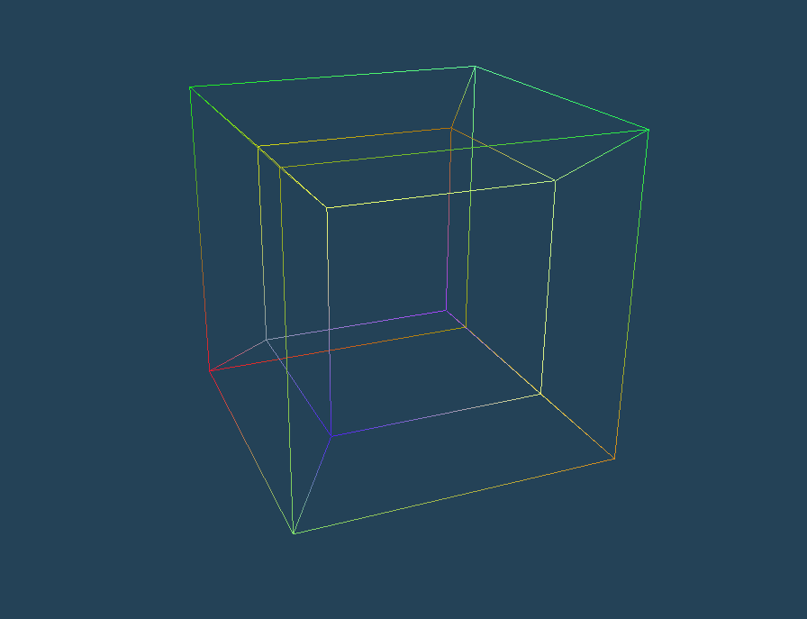

# Beyond Space: An OpenGL Tesseract Project

This is the final project for my 3D computer graphics course.
It showcases tesseract rotation and projection from 4D to 3D using OpenGL. Tesseracts, also known as hypercubes, are 4D geometric shapes.
By projecting them to 3 dimensions we can visualize their behaviour during rotation and gain a deeper understanding of 4 dimensional space

## Overview
Tesseracts, unlike 3D cubes, consist of 16 vertices. Upon placing a tesseract, a random color is assigned to each of these vertices. 

During rotation, the vector of (r,g,b)
values of each vertex is multiplied by a 3D rotation matrix making it change colors with a period of 2 * PI, at the same speed as the rotation of
the tesseract itself. This means that when the tesseract performs a full rotation the colors will be back to the originally assigned colors.

What we see here is a tesseract wireframe projected to 3D then projected to our 2D screen. It looks like 2 cubes, one inside another, with connected vertices. Think of it like casting a shadow of a 4D tesseract wireframe to 3D. It is analogous to casting a shadow of a cube wireframe (3D object) onto a wall (2D surface).

Now imagine rotating the cube wireframe, the shadow on the wall would distort. The same goes for the tesseract's shadow.
In 3D, objects rotate around axes (i.e. x, y or z), while objects in 4 dimensions rotate around planes. Here, i have implemented rotation
in 6 planes - the xw, yw, zw, xy, yz and xz plane. By pressing the numbers 1,..,6 we can toggle rotations around different planes. By pressing the R
key we can toggle all rotations on/off.

You can change the FOV with the up/down arrow keys. There is no limit so the FOV can be any number, even above 180 or below 0 degrees which makes the screen flip.

## Running the Program

Download the repository and run `out.exe`.  
Run `compile.bat` to recompile the project.

## Controls

- **Movement**: W, A, S, D, SPACE, LCTRL
- **Increase Speed**: LSHIFT
- **Close Window**: ESC

- **Tesseract Controls**:
  - Toggle Rotation: R
  - Set Camera Position to Origin: O
  - Spawn Tesseract: T
  - Delete All Tesseracts: Delete

- **Planes of rotation**:
  - Toggle Rotation Around xw Plane: 1
  - Toggle Rotation Around yw Plane: 2
  - Toggle Rotation Around zw Plane: 3
  - Toggle Rotation Around xy Plane: 4
  - Toggle Rotation Around yz Plane: 5
  - Toggle Rotation Around xz Plane: 6

- **Field of View**:
  - Increase: Arrow Key Up
  - Decrease: Arrow Key Down

## Sources

The basic, template code is based on Victor Gordan's introduction to OpenGL, available [here](https://github.com/VictorGordan/opengl-tutorials/tree/main/YoutubeOpenGL%2016%20-%20Face%20Culling%20%26%20FPS%20Counter).

For mathematics behind 4D to 3D transformations, refer to [this resource](https://hollasch.github.io/ray4/Four-Space_Visualization_of_4D_Objects.html).

For a step-by-step coding implementation of a rotating tesseract watch [this](https://www.youtube.com/watch?v=XE3YDVdQSPo)
